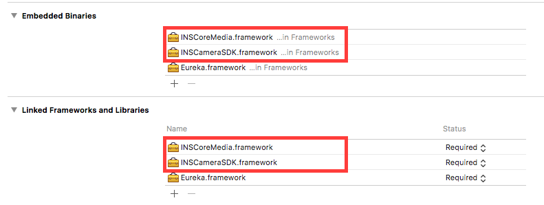
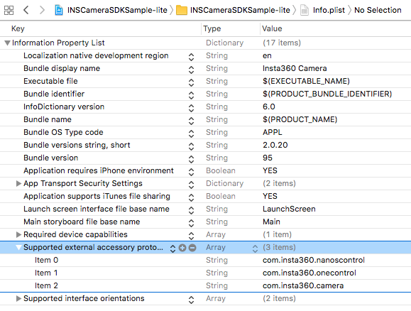
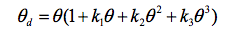
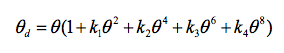

## How to get?
Please visit [https://www.insta360.com/sdk/apply](https://www.insta360.com/sdk/apply) to apply for the latest SDK.

# iOS SDK

You can learn how to control the Insta360 camera in the following section. And the camera supports the following two communication protocols:

1. SCMP (Spherical Camera Messaging Protocol)
	
	All the native interfaces in the framework are based on the SCMP(Spherical Camera Messaging Protocol) developed by Insta360.

2. OSC (Open Spherical Camera)
	
	Camera supports the control command of [Open Spherical Camera API level 2](https://developers.google.com/streetview/open-spherical-camera/reference), except preview stream. Familiarity with [`Open Spherical Camera API - Commands`](https://developers.google.cn/streetview/open-spherical-camera/guides/osc/commands) official documentation is a prerequisite for OSC development.
	
We suggest that you use the same protocol to control the camera in the whole development process. If you want to control the camera through the OSC protocol, please check the [OSC](#OSC) section of the document directly.

## Table of Contents

- [Integration](#Integration)
	- [Carthage](#Carthage)
	- [Setup](#Setup)
- [Connection](#Connection)
	- [Status](#Status)
	- [Heartbeat](#Heartbeat)
- [Commands](#Commands)
	- [Take Picture](#Take_Picture)
	- [Record Video](#Record_Video)
	- [Photography options](#Set_Photography_Options)
	- [Multi photography options](#Multi_PhotographyOptions)
	- [Timelapse options](#Timelapse_Options)
	- [List files](#SCMP_List_files)
- [Working with audio & video stream](#Audio_Video_Stream)
	- [Control center](#Control_center)
	- [Preview](#Preview)
	- [For further preview config](#Further_Config)
	- [Switching capture lens](#Switch_Lens)
	- [Stitched outputs](#Stitched_outputs)
	- [RTMP live stream](#RTMP_Live_Stream)
- [Media](#Media)
	- [INSExtraInfo](#INSExtraInfo)
	- [Thumbnail](#Thumbnail)
	- [Stitch](#Stitch)
	- [Generate HDR image](#Generate_HDR_image)
	- [Gyroscope data](#Gyroscope_data)
	- [EXIF & XMP](#EXIF&XMP)
- [Playback](#Playback)
- [Internal parameters](#Internal_parameters)
- [OSC](#OSC)

## <a name="Integration" />Integration</a>

- Download the SDK

```ogdl
binary "#INSCoreMedia:By applying for authorization from Insta360#" == 1.25.30
binary "#INSCameraSDK-osc:By applying for authorization from Insta360#" == 3.0.5
```

### <a name="Setup" />Setup</a>

1. Embed the INSCameraSDK and INSCoreMedia frameworks to your project target.
<div align=center></div>

2. If you need to connect the camera via wired, you should add the following item into Info.plist. One X2, X3, and X4 do not support wired connection with iOS device. Please skip the following steps.

- Key is *Supported external accessory protocols*, value is an Array with following items `com.insta360.camera`(Nano), `com.insta360.onecontrol`(ONE), `com.insta360.onexcontrol`(ONE X), `com.insta360.nanoscontrol`(Nano S) and `com.insta360.onercontrol`(ONE R)
<div align=center></div>

## <a name="Connection" />Connection</a>

You can get the wifi name and password through Bluetooth's INSCamerasdSDK, And you can refer to the code in sample
```Swift
/// Global Bluetooth management object,
let bluetoothManager = INSBluetoothManager()
/// Currently connected device
var connectedDevice: INSBluetoothDevice?

/// Scan the camera you want to connect
- (void)scanCamerasWithHandler:(void (^)(INSBluetoothDevice * _Nonnull device,
                                         NSNumber * _Nonnull RSSI,
                                         NSDictionary<NSString *, id> * _Nonnull advertisementData))handler;
/// Connect the scanned camera
- (id)connectDevice:(INSBluetoothDevice *)device
         completion:(void(^)(NSError  * _Nullable error))completion;

///sample
 self?.bluetoothManager.scanCameras(handler: { device, rssi, advertisementData in
	 if (self?.connectedDevice != nil) {
		 self?.bluetoothManager.disconnectDevice(self!.connectedDevice!);
	 }
	 self?.bluetoothManager.connect(device, completion: { (err) in
		 print(device.peripheral.identifier)
		if (err == nil) {
			 self?.connectedDevice = device
		}
	})
})

///get wifi info
guard let peripheral = self?.connectedDevice else { return }
let commandManager = self?.bluetoothManager.command(by: peripheral)
let optionTypes = [
                    NSNumber(value: INSCameraOptionsType.serialNumber.rawValue),
                    NSNumber(value: INSCameraOptionsType.wifiInfo.rawValue),
                    NSNumber(value: INSCameraOptionsType.wifiChannelList.rawValue),
                    NSNumber(value: INSCameraOptionsType.cameraType.rawValue)
                ]
commandManager?.getOptionsWithTypes(optionTypes, completion: { (err, options, successTypes) in
  	if let err = err {
		 self?.showAlert("\((err as NSError).code)", err.localizedDescription)
	} else {
		self?.showAlert(options?.wifiInfo?.ssid ?? "", options?.wifiInfo?.password ?? "")
	}
})
```

If you connect camera via wifi, you need to set the host to `http://192.168.42.1`. and if you connect camera via the Lightning interface, you need to change the host to `http://localhost:9099`.

We recommend using the following methods to convert the URL and path

```Objective-C
/// convert (photo or video) resource uri to http url via http tunnel and Wi-Fi socket
extern NSURL *INSHTTPURLForResourceURI(NSString *uri);

/// convert local http url to (photo or video) resource uri
extern NSString *INSResourceURIFromHTTPURL(NSURL *url);
```

### <a name="INS_Protocol" />SCMP(Spherical Camera Messaging Protocol)</a>

Add the following code in your AppDelegate, or somewhere your app is ready to work with Insta360 cameras via the wired (connect the camera through the Lightning interface). 

And if you connect camera via WiFi, you should add `[[INSCameraManager socketManager] setup]` once where you need to start the socket connection. 

The connection is asynchronous. You need to monitor the connection status and operate the camera when the connection status is `INSCameraStateConnected`. 

What's more, call `[[INSCameraManager sharedManager] shutdown]` when your app won't listen on Insta360 cameras any more. [see connection monitoring](#Status)

```Objective-C
#import <INSCameraSDK/INSCameraSDK.h>

- (BOOL)application:(UIApplication *)application didFinishLaunchingWithOptions:(NSDictionary *)launchOptions {
    // connet camera via wired
    [[INSCameraManager usbManager] setup];
    return YES;
}
```

#### <a name="Status" />Status</a>

You can monitor the connection status of the camera in the following ways:

- register notification for `[NSNotificationCenter defaultCenter]` with the name of `INSCameraDidConnectNotification` or `INSCameraDidDisconnectNotification`

- add KVO on `[INSCameraManager SharedManager].cameraState`, once the cameraState changes to INSCameraStateConnected, your app is able to send commands to the camera.

```Objective-C
- (void)observeValueForKeyPath:(NSString *)keyPath ofObject:(id)object change:(NSDictionary<NSKeyValueChangeKey,id> *)change context:(void *)context {
    if (![object isKindOfClass:[INSCameraManager class]]) {
        [super observeValueForKeyPath:keyPath ofObject:object change:change context:context];
        return ;
    }
    INSCameraManager *manager = (INSCameraManager *)object;
    INSCameraState state = [change[NSKeyValueChangeNewKey] unsignedIntegerValue];
    switch (state) {
    case INSCameraStateFound: {
    	NSLog(@"Found");
    	break;
    }
    case INSCameraStateConnected: {
    	NSLog(@"Connected");
	if (manager == [INSCameraManager socketManager]) {
	    [self startSendingHeartbeats];
        }
	break;
    }
    case INSCameraStateConnectFailed: {
    	NSLog(@"Failed");
	[self stopSendingHeartbeats];
	break;
    }
    default:
    	NSLog(@"Not Connect");
	[self stopSendingHeartbeats];
	break;
    }
}
```

#### <a name="Heartbeat" />Heartbeat</a>

When you connect your camera via wifi, you need to send heartbeat information to the camera at 2 Hz (every 500ms).

```Objective-C
// Objective-C
[[INSCameraManager socketManager].commandManager sendHeartbeatsWithOptions:nil]
```

## <a name="Commands" />Commands</a>

You can learn all the commands supported by the SDK from `INSCameraCommands.h`, and `INSCameraCommandOptions.h` shows the structure needed by all commands. All options that you can get from camera are list in `INSCameraOptionsType`.

`NSNotification+INSCamera.h` show that the application can get the notification of camera by monitoring.

Here is a sample code shows how to get storage & battery through `getOptionsWithTypes:completion:`

```Objective-C
NSArray *optionTypes = @[@(INSCameraOptionsTypeStorageState),@(INSCameraOptionsTypeBatteryStatus)];
[[INSCameraManager sharedManager].commandManager getOptionsWithTypes:optionTypes completion:^(NSError * _Nullable error, INSCameraOptions * _Nullable options, NSArray<NSNumber *> * _Nullable successTypes) {
    if (!options) {
        NSLog(@"fetch options error: %@",error.description);
        return ;
    }
    NSLog(@"storage status: %@",options.storageStatus);
    NSLog(@"battery status: %@",options.batteryStatus);
}];
```

- Here is the storage info which is listed in `INSCameraOptions.h`

```Objective-C
typedef NS_ENUM(NSUInteger, INSCameraCardState) {

    INSCameraCardStateNormal = 0,
    
    INSCameraCardStateNoCard = 1,

    INSCameraCardStateNoSpace = 2,

    INSCameraCardStateInvalidFormat = 3,
    
    INSCameraCardStateWriteProtectCard = 4,
    
    INSCameraCardStateUnknownError = 5,
};

@interface INSCameraStorageStatus : NSObject

@property (nonatomic) INSCameraCardState cardState;

@property (nonatomic) int64_t freeSpace;

@property (nonatomic) int64_t totalSpace;

@end
```

- Here is the battery info which is listed in `INSCameraOptions.h`

```Objective-C
typedef NS_ENUM(NSUInteger, INSCameraPowerType) {
    INSCameraPowerTypeBattery = 0,
    INSCameraPowerTypeAdapter = 1,
};

@interface INSCameraBatteryStatus : NSObject

@property (nonatomic) INSCameraPowerType powerType;

@property (nonatomic) NSInteger batteryLevel;

@property (nonatomic) NSInteger batteryScale;

@end
```

#### <a name="Take_Picture" />Take Picture</a>

Call `takePictureWithOptions:completion`, the photo will be saved into the SD card without transferring data to the iOS app

- When you are setting the EV parameter for HDR photography, make sure that you have EV=0 as the first parameter followed by the rest of EV levels in ascending orders. For instance, if the EV interval is set at 1 and it consist of 5 captures for a HDR image, the EV array should go as [0, -2, -1, 1, 2].

```Objective-C
INSTakePictureOptions *options = [[INSTakePictureOptions alloc] init];
options.mode = INSPhotoModeAeb;
options.AEBEVBias = @[@(0), @(-2), @(-1), @(1), @(2)];
options.generateManually = YES;
/// X4
options.inerProccess = true;
/// others
options.inerProccess = false;
[[INSCameraManager sharedManager].commandManager takePictureWithOptions:options completion:^(NSError * _Nullable error, INSCameraPhotoInfo * _Nullable photoInfo) {
    NSLog(@"take hdr picture: %@, %@",photoInfo.uri,photoInfo.hdrUris);
}];
```

> Note: `true` indicates that fusion is not required for outputting HDR photos, while `false` indicates that fusion is necessary. The X4 supports in-camera HDR fusion, so it only needs to be set to `true`, while other camera models should be set to `false`. When the X4 is in HDR Photo mode, captured photos will always have the fused effect. Therefore, when using the X4, HDR effects can only be disabled by switching to a different mode.

#### <a name="Record_Video" />Record Video</a>

Call `setOptions:completion` to change shooting mode.

```Objective-C
/// change to photo mode
INSCameraOptions *options = [[INSCameraOptions alloc] init];
options.photoSubMode = self.INSPhotoSubModeSingle;
[[INSCameraManager sharedManager].commandManager setOptions:options forTypes:@[@(INSCameraOptionsTypePhotoSubMode)] completion:^(NSError * _Nullable error, NSArray<NSNumber *> * _Nullable successTypes) {
                
}];
/// change to video mode
INSCameraOptions *options = [[INSCameraOptions alloc] init];
options.videoSubMode = self.INSVideoSubModeNormal;
[[INSCameraManager sharedManager].commandManager setOptions:options forTypes:@[@(INSCameraOptionsTypeVideoSubMode)] completion:^(NSError * _Nullable error, NSArray<NSNumber *> * _Nullable successTypes) {
                
}];

- When using the X4, you need to switch to the corresponding shooting mode first.

Call `startCaptureWithOptions:completion` to start recording, and call `stopCaptureWithOptions:completion` to stop the recording.

```Objective-C
// start recording
INSCaptureOptions *options = [[INSCaptureOptions alloc] init];
[[INSCameraManager sharedManager].commandManager startCaptureWithOptions:options completion:^(NSError * _Nullable error) {
    if (error) {
        NSLog(@"start capture error: %@",error);
    }
}];

// stop recording
INSCaptureOptions *options = [[INSCaptureOptions alloc] init];
[[INSCameraManager sharedManager].commandManager stopCaptureWithOptions:options completion:^(NSError * _Nullable error, INSCameraVideoInfo * _Nullable videoInfo) {
    NSLog(@"video url: %@",videoInfo.uri);
}];
```

#### <a name="Set_Photography_Options" />Set Photography Options</a>

The INSCameraSDK also provides APIs to adjust photography options, such as EV, white balance, exposure program, ISO and shutter speed.

As the shutter speed of still and video may be different, set stillExposure to manual program will not effect the live stream, so you need to call `setPhotographyOptions` again to set the liveStream's videoExposure. Note that the shutter speed of videoExposure should not be larger than 1.0/framerate.

```Objective-C
// live stream, X4 does not require setup.
INSCameraExposureOptions *videoExposureOptions = [[INSCameraExposureOptions alloc] init];
videoExposureOptions.program = INSCameraExposureProgramManual;
videoExposureOptions.iso = 200;
videoExposureOptions.shutterSpeed = CMTimeMake(1, 30);

INSPhotographyOptions *options = [[INSPhotographyOptions alloc] init];
options.videoExposure = videoExposureOptions;

NSArray *types = @[@(INSPhotographyOptionsTypeVideoExposureOptions)];
[[INSCameraManager sharedManager].commandManager
 setPhotographyOptions:options forFunctionMode:INSCameraFunctionModeLiveStream
 types:types completion:^(NSError * _Nullable error, NSArray<NSNumber *> * _Nullable successTypes) {
    NSLog(@"Set Photogtaphy Options %@",error);
}];
```

```Objective-C
// take normal picture
INSCameraExposureOptions *stillExposureOptions = [[INSCameraExposureOptions alloc] init];
stillExposureOptions.program = INSCameraExposureProgramManual;
stillExposureOptions.iso = 200;
stillExposureOptions.shutterSpeed = CMTimeMake(5, 1);

INSPhotographyOptions *options = [[INSPhotographyOptions alloc] init];
options.stillExposure = stillExposureOptions;

NSArray *types = @[@(INSPhotographyOptionsTypeStillExposureOptions)];
[[INSCameraManager sharedManager].commandManager
 setPhotographyOptions:options forFunctionMode:INSCameraFunctionModeNormalImage
 types:types completion:^(NSError * _Nullable error, NSArray<NSNumber *> * _Nullable successTypes) {
    NSLog(@"Set Photogtaphy Options %@",error);
}];
```

```Objective-C
// In-camera processing for PureShot is only supported on the X4 and is enabled by default when PureShot is set.
INSPhotographyOptions *options = [[INSPhotographyOptions alloc] init];
options.rawCaptureType = INSCameraRawCaptureTypePureshot;
NSArray *types = @[@(INSCameraRawCaptureType)];
[[INSCameraManager sharedManager].commandManager
 setPhotographyOptions:options forFunctionMode:INSCameraFunctionModeNormalImage
 types:types completion:^(NSError * _Nullable error, NSArray<NSNumber *> * _Nullable successTypes) {
    NSLog(@"Set Photogtaphy Options %@",error);
}];
```

```Objective-C
// In-camera stitching is only supported on X4.
INSCameraOptions *options = [[INSCameraOptions alloc] init];
options.enableInternalSplicing = true;
NSArray *types = @[@(INSCameraOptionsTypeInternalSplicing)];
[[INSCameraManager sharedManager].commandManager setOptions:options forTypes:types completion:^(NSError * _Nullable error, NSArray<NSNumber *> * _Nullable successTypes) {
   
}];

#### <a name="Multi_PhotographyOptions" />Multi Photography Options</a>

When the capture mode is switched to `Wide angle`, you need to use `INSMultiPhotographyOptions` to modify the following capture parameters.

```Objective-C
typedef NS_ENUM(uint16_t, INSMultiPhotographyOptionsType) {
	 /// Default
    INSMultiPhotographyOptionsTypeUnknown = 0,
    
    /// Capture resolution, readwrite. @available ONE X2
    INSMultiPhotographyOptionsTypeResolution = 1,
    
    /// Indicates whether the video is internal flowstate, readwrite. @available ONE X2
    INSMultiPhotographyOptionsTypeInternalFlowstate = 2,
    
    /// Indicates whether the captured file is a portrait file or a landscape file, readwrite. @available ONE X2
    INSMultiPhotographyOptionsTypeDimensionType = 3,
    
    /// Fov type, readwrite. @available ONE X2
    INSMultiPhotographyOptionsTypeFovType = 4,
};
```

#### <a name="Timelapse_Options" />Timelapse Options</a>

Call `setTimelapseOptions:forMode:completion:` to config the timelapse options, and call `startCaptureTimelapseWithOptions:completion:` to start capture timelapse video.

P.s. The `timelapseOptions` in `INSStartCaptureTimelapseOptions` only be used to calculate timeout, will not be set to camera. If you want to change the config of timelapse video, you should call `setTimelapseOptions:forMode:completion:` first.

```Objective-C
INSTimelapseOptions *options = [[INSTimelapseOptions alloc] init];
options.duration = #total record duration that you expect#;
options.lapseTime = #the time interval for capturing each picture#;

[[INSCameraManager sharedManager].commandManager
 setTimelapseOptions:options
 forMode:weakSelf.mode
 completion:^(NSError * _Nullable error) {
    if (error) {
        NSLog(@"error: %@",error.localizedDescription);
    } else {
        // success
    }
}];
```

#### <a name="SCMP_List_files" />List files</a>

The file list is divided into the following interfaces:

- insp(Insta360 pano image) & jpg(Insta360 wide angle image)

```
[[INSCameraManager sharedManager].commandManager 
 fetchPhotoListWithCompletion:^(NSError * _Nullable error, NSArray<INSCameraPhotoInfo *> * _Nullable photoInfoList) {
    NSLog(@"files: %@",photoInfoList);
}];
```

- insv(Insta360 pano video) & mp4(Insta360 wide angle video)

```
[[INSCameraManager sharedManager].commandManager 
 fetchVideoListWithCompletion:^(NSError * _Nullable error, NSArray<INSCameraVideoInfo *> * _Nullable videoInfoList) {
    NSLog(@"files: %@",videoInfoList);
}];
```

- raw

```
[[INSCameraManager sharedManager].commandManager
 fetchRawPhotoListWithCompletion:^(NSError * _Nullable error, NSArray<INSCameraPhotoInfo *> * _Nullable photoInfoList) {
    NSLog(@"files: %@",photoInfoList);
}];
```

## <a name="Audio_Video_Stream" />Working with audio & video stream</a>

Audio and video stream is based on SCMP(Spherical Camera Messaging Protocol). If you need to preview the camera in real time, make sure that the `INSCameraManager.cameraState` is `INSCameraStateConnected`. see [SCMP(Spherical Camera Messaging Protocol) connection](#INS_Protocol)

### <a name="Control_center" />Control center - `INSCameraMediaSession`</a>

`INSCameraMediaSession` is the central class to work with audio & video streams for Insta360 camera. It has these functions:

1. You can configure the input (the camera) by setting the `expectedAudioSampleRate`, `expectedVideoResolution` and `gyroPlayMode`.
2. Control the camera's input streams, turn on by calling `startRunningWithCompletion:`, turn off by calling `stopRunningWithCompletion:`.
3. Parse and decode media data, stitch the video.
4. Distribute outputs to `INSCameraMediaPluggable` such as `INSCameraFlatPanoOutput`.
5. When the session is running, you can change the input configurations, plug or unplug pluggables, make the changes working by calling `commitChangesWithCompletion:`.

### <a name="Preview" />Preview</a>

```Objective-C
#import <UIKit/UIKit.h>
#import <INSCameraSDK/INSCameraSDK.h>

@interface ViewController () <INSCameraPreviewPlayerDelegate>

@property (nonatomic, strong) INSCameraMediaSession *mediaSession;

@property (nonatomic, strong) INSCameraPreviewPlayer *previewPlayer;

@property (nonatomic, strong) INSCameraStorageStatus *storageState;

@property (nonatomic, assign) INSVideoEncode videoEncode;

@end

@implementation ViewController

- (instancetype)initWithNibName:(NSString *)nibNameOrNil bundle:(NSBundle *)nibBundleOrNil {
    self = [super initWithNibName:nibNameOrNil bundle:nibBundleOrNil];
    if (self) {
        _videoEncode = INSVideoEncodeH264;
        _mediaSession = [[INSCameraMediaSession alloc] init];
    }
    return self;
}

- (instancetype)initWithCoder:(NSCoder *)aDecoder {
    return [super initWithCoder:aDecoder];
}

- (void)dealloc {
    [_mediaSession stopRunningWithCompletion:^(NSError * _Nullable error) {
        NSLog(@"stop media session with err: %@", error);
    }];
    
    [[INSCameraManager usbManager] removeObserver:self forKeyPath:@"cameraState"];
    [[INSCameraManager socketManager] removeObserver:self forKeyPath:@"cameraState"];
}

- (void)viewDidLoad {
    [super viewDidLoad];
    
    [[INSCameraManager usbManager] addObserver:self forKeyPath:@"cameraState" options:NSKeyValueObservingOptionNew context:nil];
    [[INSCameraManager socketManager] addObserver:self forKeyPath:@"cameraState" options:NSKeyValueObservingOptionNew context:nil];
    
    [self setupRenderView];
}

- (void)viewWillAppear:(BOOL)animated {
    [super viewWillAppear:animated];
    
    if ([INSCameraManager sharedManager].currentCamera) {
        __weak typeof(self)weakSelf = self;
        [self fetchOptionsWithCompletion:^{
            [weakSelf updateConfiguration];
            [weakSelf runMediaSession];
        }];
    }
}

- (void)updateConfiguration {
    // main stream resolution
    _mediaSession.expectedVideoResolution = INSVideoResolution1920x960x30;
    
    // secondary stream resolution
    _mediaSession.expectedVideoResolutionSecondary = INSVideoResolution960x480x30;
    
    // use main stream or secondary stream to preview
    _mediaSession.previewStreamType = INSPreviewStreamTypeSecondary;
    
    // audio sample rate
    _mediaSession.expectedAudioSampleRate = INSAudioSampleRate48000Hz;
    
    // preview stream encode
    _mediaSession.videoStreamEncode = INSVideoEncodeH264;
    
    // gyroscope correction mode
    // If you are in panoramic preview, use `INSGyroPlayModeDefault`.
    // If you are in wide angle preview, use `INSGyroPlayModeFootageMotionSmooth`.
    _mediaSession.gyroPlayMode = INSGyroPlayModeDefault;
}

- (void)setupRenderView {
    CGFloat height = CGRectGetHeight(self.view.bounds) * 0.333;
    CGRect frame = CGRectMake(0, CGRectGetHeight(self.view.bounds) - height, CGRectGetWidth(self.view.bounds), height);
    _previewPlayer = [[INSCameraPreviewPlayer alloc] initWithFrame:frame
                                                        renderType:INSRenderTypeSphericalPanoRender];
    [_previewPlayer playWithGyroTimestampAdjust:30.f];
    _previewPlayer.delegate = self;
    [self.view addSubview:_previewPlayer.renderView];
    
    [_mediaSession plug:self.previewPlayer];
    
    // adjust field of view parameters
    NSString *offset = [INSCameraManager sharedManager].currentCamera.settings.mediaOffset;
    if (offset) {
        NSInteger rawValue = [[INSLensOffset alloc] initWithOffset:offset].lensType;
        if (rawValue == INSLensTypeOneR577Wide || rawValue == INSLensTypeOneR283Wide) {
            _previewPlayer.renderView.enablePanGesture = NO;
            _previewPlayer.renderView.enablePinchGesture = NO;
            
            _previewPlayer.renderView.render.camera.xFov = 37;
            _previewPlayer.renderView.render.camera.distance = 700;
        }
    }
}

- (void)fetchOptionsWithCompletion:(nullable void (^)(void))completion {
    __weak typeof(self)weakSelf = self;
    NSArray *optionTypes = @[@(INSCameraOptionsTypeStorageState),@(INSCameraOptionsTypeVideoEncode)];
    [[INSCameraManager sharedManager].commandManager getOptionsWithTypes:optionTypes completion:^(NSError * _Nullable error, INSCameraOptions * _Nullable options, NSArray<NSNumber *> * _Nullable successTypes) {
        if (!options) {
            [weakSelf showAlertWith:@"Get options" message:error.description];
            completion();
            return ;
        }
        weakSelf.storageState = options.storageStatus;
        weakSelf.videoEncode = options.videoEncode;
        completion();
    }];
}

- (void)runMediaSession {
    if ([INSCameraManager sharedManager].cameraState != INSCameraStateConnected) {
        return ;
    }
    
    __weak typeof(self)weakSelf = self;
    if (_mediaSession.running) {
        self.view.userInteractionEnabled = NO;
        [_mediaSession commitChangesWithCompletion:^(NSError * _Nullable error) {
            NSLog(@"commitChanges media session with error: %@",error);
            weakSelf.view.userInteractionEnabled = YES;
            if (error) {
                [weakSelf showAlertWith:@"commitChanges media failed" message:error.description];
            }
        }];
    }
    else {
        self.view.userInteractionEnabled = NO;
        [_mediaSession startRunningWithCompletion:^(NSError * _Nullable error) {
            NSLog(@"start running media session with error: %@",error);
            weakSelf.view.userInteractionEnabled = YES;
            if (error) {
                [weakSelf showAlertWith:@"start media failed" message:error.description];
                [weakSelf.previewPlayer playWithSmoothBuffer:NO];
            }
        }];
    }
}

- (void)observeValueForKeyPath:(NSString *)keyPath ofObject:(id)object change:(NSDictionary<NSKeyValueChangeKey,id> *)change context:(void *)context {
    if ([keyPath isEqualToString:@"cameraState"]) {
        INSCameraState state = [change[NSKeyValueChangeNewKey] unsignedIntegerValue];
        switch (state) {
            case INSCameraStateFound:
                break;
            case INSCameraStateConnected:
                [self runMediaSession];
                break;
            default:
                [_mediaSession stopRunningWithCompletion:nil];
                break;
        }
    }
}

#pragma mark INSCameraPreviewPlayerDelegate
- (NSString *)offsetToPlay:(INSCameraPreviewPlayer *)player {
    NSString *mediaOffset = [INSCameraManager sharedManager].currentCamera.settings.mediaOffset;
    if (([[INSCameraManager sharedManager].currentCamera.name isEqualToString:kInsta360CameraNameOneX]
         || [[INSCameraManager sharedManager].currentCamera.name isEqualToString:kInsta360CameraNameOneR]
         || [[INSCameraManager sharedManager].currentCamera.name isEqualToString:kInsta360CameraNameOneX2])
        && [INSLensOffset isValidOffset:mediaOffset]) {
        return [INSOffsetCalculator convertOffset:mediaOffset toType:INSOffsetConvertTypeOneX3040_2_2880];
    }
    
    return mediaOffset;
}

@end
```

### <a name="Further_Config" />For further preview config</a>

* You can configure the preview resolution through the following parameters of `INSCameraMediaSession`, and all supported resolutions are list in `INSCameraMediaBasic.h`.

```Objective-C
/*!
 *  For one、nano s,  The expected video resolution, if you want to change the value when mediaSession is running, you need to invoke commitChangesWithCompletion:
 *  For one x, you should set resolution for both Main and Secondary stream. use 'INSPreviewStreamType' to choose which is used for preview stream.
 */
@property (nonatomic) INSVideoResolution expectedVideoResolution;

/*!
 *  The expected video resolution, if you want to change the value when mediaSession is running, you need to invoke commitChangesWithCompletion:
 */
@property (nonatomic) INSVideoResolution expectedVideoResolutionSecondary;

/*!
 *  For one X, use this to choose whether the main or secondary stream should be used as preview stream.
 *  INSPreviewStreamTypeMain : preview with main stream
 *  INSPreviewStreamTypeSecondary : preview with secondary stream
 */
@property (nonatomic) INSPreviewStreamType previewStreamType;

/*!
 *  VR180 and gyroPlayMode == RemoveYawRotations, this should be set to INSPreviewStreamRotationRaw180
 */
@property (nonatomic) INSPreviewStreamRotation previewStreamRotation;

/*!
 * The mode used to calibrate the video, default is INSGyroPlayModeDefault.
 */
@property (nonatomic) INSGyroPlayMode gyroPlayMode;

/*!
 *  The encoding format of video real-time stream, default is INSVideoEncodeH264.
 */
@property (nonatomic) INSVideoEncode videoStreamEncode;
```

### <a name="Switch_Lens" />Switching capture lens</a>

The following camera can switch capture lens:

- Insta360 ONE X2

This camera can capture three types of files as following:

- Panorama
- Insta Pano (only for photos)
- Wide angle

The following methods must be called in the order of the sample code.

```Objective-C
// Before that, you need to call 'startRunningWithCompletion:' through 'INSCameraMediaSession' to start the preview stream

NSArray *modes = @[@"Panorama", @"Insta Pano", @"Wide angle"];
NSString *currentMode = @"pano";

if ([currentMode isEqualToString:@"Panorama"]) {
    [self.mediaSession stopRunningWithCompletion:^(NSError * _Nullable error) {
        if (error != nil) {
            NSLog(@"stop media session with err: %@", error.description);
            return;
        }
        
        INSCameraOptions *options = [[INSCameraOptions alloc] init];
        options.focusSensor = INSSensorDeviceAll;
        options.expectOutputType = INSCameraExpectOutputTypeDefault;
        
        NSArray *types = @[@(INSCameraOptionsTypeFocusSensor), @(INSCameraOptionsTypeExpectOutputType)];
        
        [[INSCameraManager sharedManager].commandManager setOptions:options forTypes:types completion:^(NSError * _Nullable error, NSArray<NSNumber *> * _Nullable successTypes) {
            if (error != nil) {
                [self showAlertWith:@"" message:error.localizedDescription];
                return;
            }
            
            [[INSCameraManager sharedManager].commandManager setActiveSensorWithDevice:INSSensorDeviceAll completion:^(NSError * _Nullable error, NSString * _Nullable mediaOffset) {
                if (error) {
                    [self showAlertWith:@"Failed" message:error.description];
                } else {
                    NSString *message = [NSString stringWithFormat:@"current offset: %@", mediaOffset];
                    [self showAlertWith:@"Success" message:message];
                    [self.previewPlayer.renderView clearCurrentPlayImage];
                    [self runMediaSession];
                }
            }];
        }];
        
    }];
} else if ([currentMode isEqualToString:@"Insta Pano"]) {
    [self.mediaSession stopRunningWithCompletion:^(NSError * _Nullable error) {
        if (error != nil) {
            NSLog(@"stop media session with err: %@", error.description);
            return;
        }
        
        INSCameraOptions *options = [[INSCameraOptions alloc] init];
        options.focusSensor = INSSensorDeviceRear;
        options.expectOutputType = INSCameraExpectOutputTypeInstaPano;
        
        NSArray *types = @[@(INSCameraOptionsTypeFocusSensor), @(INSCameraOptionsTypeExpectOutputType)];
        
        [[INSCameraManager sharedManager].commandManager setOptions:options forTypes:types completion:^(NSError * _Nullable error, NSArray<NSNumber *> * _Nullable successTypes) {
            if (error != nil) {
                [self showAlertWith:@"" message:error.localizedDescription];
                return;
            }
            
            [[INSCameraManager sharedManager].commandManager setActiveSensorWithDevice:INSSensorDeviceAll completion:^(NSError * _Nullable error, NSString * _Nullable mediaOffset) {
                if (error) {
                    [self showAlertWith:@"Failed" message:error.description];
                } else {
                    NSString *message = [NSString stringWithFormat:@"current offset: %@", mediaOffset];
                    [self showAlertWith:@"Success" message:message];
                    [self.previewPlayer.renderView clearCurrentPlayImage];
                    [self runMediaSession];
                }
            }];
        }];
        
    }];
    
} else if ([currentMode isEqualToString:@"Wide angle"]) {
    [self.mediaSession stopRunningWithCompletion:^(NSError * _Nullable error) {
        if (error != nil) {
            NSLog(@"stop media session with err: %@", error.description);
            return;
        }
        
        INSCameraOptions *options = [[INSCameraOptions alloc] init];
        options.focusSensor = INSSensorDeviceRear;
        options.expectOutputType = INSCameraExpectOutputTypeDefault;
        
        NSArray *types = @[@(INSCameraOptionsTypeFocusSensor), @(INSCameraOptionsTypeExpectOutputType)];
        
        [[INSCameraManager sharedManager].commandManager setOptions:options forTypes:types completion:^(NSError * _Nullable error, NSArray<NSNumber *> * _Nullable successTypes) {
            if (error != nil) {
                [self showAlertWith:@"" message:error.localizedDescription];
                return;
            }
            
            [[INSCameraManager sharedManager].commandManager setActiveSensorWithDevice:INSSensorDeviceRear completion:^(NSError * _Nullable error, NSString * _Nullable mediaOffset) {
                if (error) {
                    [self showAlertWith:@"Failed" message:error.description];
                } else {
                    NSString *message = [NSString stringWithFormat:@"current offset: %@", mediaOffset];
                    [self showAlertWith:@"Success" message:message];
                    [self.previewPlayer.renderView clearCurrentPlayImage];
                    [self runMediaSession];
                }
            }];
        }];
        
    }];
}
```

### <a name="Stitched_outputs" />Stitched outputs </a>

`INSCameraFlatPanoOutput` instance will produce flat panorama video and camera's audio for you.

`INSCameraScreenOutput` instance will produce screen captured video and camera's audio for you.

```Objective-C
INSVideoResolution resolution = INSVideoResolution720x360x30;
_flatPanoOutput = [[INSCameraFlatPanoOutput alloc] initWithOutputWidth:resolution.width
                                                          outputHeight:resolution.height];
[_flatPanoOutput setDelegate:self onDispatchQueue:nil];

/**
 *  set output pixel format to kCVPixelFormatType_32BGRA
 *  if you want to receive the video in bgra instead of NV12 format
 *  flatPanoOutput?.outputPixelFormat = kCVPixelFormatType_32BGRA
 */
[_mediaSession plug:_flatPanoOutput];
```

### <a name="RTMP_Live_Stream" />RTMP live stream</a>

`INSFlatRTMPStreamer` is the way to do rtmp live streaming.

```Objective-C
- (void)startLive {
    NSInteger bitrate = 10 * 1024 * 1024;
    NSURL *url = #live url#;
    INSFlatRTMPStreamer *streamer =
    [[INSFlatRTMPStreamer alloc] initWithURL:url width:3840 height:1920 fps:30 bitrate:bitrate];
    streamer.delegate = self;

    [self runMediaSession];
    [streamer startLive];
}

- (void)runMediaSession {
    if ([INSCameraManager sharedManager].cameraState != INSCameraStateConnected) {
        return ;
    }
    
    __weak typeof(self)weakSelf = self;
    if (_mediaSession.running) {
        self.view.userInteractionEnabled = NO;
        [_mediaSession commitChangesWithCompletion:^(NSError * _Nullable error) {
            NSLog(@"commitChanges media session with error: %@",error);
            weakSelf.view.userInteractionEnabled = YES;
            if (error) {
                [weakSelf showAlertWith:@"commitChanges media failed" message:error.description];
            }
        }];
    }
    else {
        self.view.userInteractionEnabled = NO;
        [_mediaSession startRunningWithCompletion:^(NSError * _Nullable error) {
            NSLog(@"start running media session with error: %@",error);
            weakSelf.view.userInteractionEnabled = YES;
            if (error) {
                [weakSelf showAlertWith:@"start media failed" message:error.description];
                [weakSelf.previewPlayer playWithSmoothBuffer:NO];
            }
        }];
    }
}
```

## <a name="Media" />Media</a>

There is a special data segment in the video or photo captured by Insta360 camera, which is called INSExtraInfo. The INSExtraInfo contains the corresponding file's thumbnail, extra metedata, gyroscope data, etc. For more information, please check `INSExtraInfo.h`.

In general, we suggest that you obtain the above information from a file whose file name `(VIN Channel)(Stream Num)` is '00'. For example: `IMG_19700101_000000_00_001.insp`.

If you are working on a wide angle file, and the file is a selfies file ( [how to knonw a file is a selfies file](#INSExtraInfo) ), you should use `IMG_19700101_000000_10_001.insp` which `(VIN Channel)` is '1' instead .

- fileName format: `(IMG/VID)_Date_Time_(VIN Channel)(Stream Num)_Serial.Extension`

### <a name="INSExtraInfo" />INSExtraInfo</a>

INSExtraInfo contains the corresponding file's thumbnail, extra metedata, gyroscope data, etc. You can get the above information through `INSImageInfoParser`/`INSVideoInfoParser`.

```Objective-C
NSURL *url = #source url#
INSImageInfoParser *parser = [[INSImageInfoParser alloc] initWithURL:url];
if ([parser open]) {
    BOOL isLensSelfies = parser.extraInfo.metadata.lensSelfies;
}
```

```Objective-C
NSURL *url = #source url#
INSVideoInfoParser *parser = [[INSVideoInfoParser alloc] initWithURL:url];
if ([parser openFast]) {
    BOOL isLensSelfies = parser.extraInfo.metadata.lensSelfies;
}
```

### <a name="Thumbnail" />Thumbnail</a>

#### <a name="Thumbnail_Photos" />Photos</a>

You can get the pre stored thumbnail data in the file through `INSImageInfoParser`. 

```Objective-C
NSURL *url = #source url#
INSImageInfoParser *parser = [[INSImageInfoParser alloc] initWithURL:url];
if ([parser open]) {
    NSData *data = parser.extraInfo.thumbnail;
    UIImage *thumbnail = [[UIImage alloc] initWithData:data];
}
```
If you are working on a panoramic file, you also need to stitch the file, see [how to stitch image](#Stitch).

#### <a name="Thumbnail_Videos" />Videos</a>

You can get the pre stored thumbnail data in the file through `INSVideoInfoParser`. 

```Objective-C
NSURL *url = #source url#
INSVideoInfoParser *parser = [[INSVideoInfoParser alloc] initWithURL:url];

UIImage *thumbnail;
if ([parser openFast]) {
    INSThumbnailRender *render = [[INSThumbnailRender alloc] init];
    
    NSData *data = parser.extraInfo.thumbnail;
    CVPixelBufferRef buffer = [render copyPixelBufferWithDecodeH264Data:data];
    
    // if and only if the video resolution is 5.7k, the thumbnails are divided into thumbnail and ext_thumbnail
    if (parser.extraInfo.metadata.dimension.width == INSVideoResolution2880x2880x30.width
        && parser.extraInfo.metadata.dimension.height == INSVideoResolution2880x2880x30.height) {
        NSData *extData = parser.extraInfo.ext_thumbnail;
        CVPixelBufferRef extBuffer = [render copyPixelBufferWithDecodeH264Data: extData];
        thumbnail = [UIImage imageWithPixelBuffer:buffer rightPixelBuffer:extBuffer];
    } else {
        thumbnail = [UIImage imageWithPixelBuffer:buffer];
    }
}
```
If you are working on a panoramic file, you also need to do a splicing of the file, see [how to stitch image](#Stitch).

### <a name="Stitch" />Stitch</a>

The following parameters are needed to correct and stitch a picture:

- offset
- gyroscope data
- resolution

Here is a sample code shows how to get these parameters:

```Objective-C 
#pragma mark Photos

NSURL *url = #source url#
INSImageInfoParser *parser = [[INSImageInfoParser alloc] initWithURL:url];
if ([parser open]) {
    // offset
    NSString *offset = parser.extraInfo.metadata.offset;

    // resolution
    CGSize resolution = parser.extraInfo.metadata.dimension;

    // gyroscope data
    INSExtraGyroData *gyroData = parser.extraInfo.gyroData;
}
```

```Objective-C 
#pragma mark Videos

NSURL *url = #source url#
INSVideoInfoParser *parser = [[INSVideoInfoParser alloc] initWithURL:url];
if ([parser openFast]) {
    // offset
    NSString *offset = parser.extraInfo.metadata.offset;

    // resolution
    CGSize resolution = parser.extraInfo.metadata.dimension;

    // gyroscope data
    INSExtraGyroData *gyroData = parser.extraInfo.gyroData;
}
```

#### <a name="Stitch_Photos" />Photos</a>

Using `INSFlatPanoOffscreenRender` to get a flat pano image. ( P.s. The parameter, `offset` is nonnull )

```Objective-C 
// if it is the original image, we recommend that outputsize be set to `parser.extraInfo.metadata.dimension`
CGSize outputSize = #output size#
UIImage *origin = #photo thumbnail to be stitched#

NSURL *url = #source url#
INSImageInfoParser *parser = [[INSImageInfoParser alloc] initWithURL:url];
if ([parser open]) {
    INSFlatPanoOffscreenRender *render = [[INSFlatPanoOffscreenRender alloc] initWithRenderWidth:outputSize.width height:outputSize.height];
    render.eulerAdjust = parser.extraInfo.metadata.euler;
    render.offset = parser.extraInfo.metadata.offset;
    
    render.gyroStabilityOrientation = GLKQuaternionIdentity;
    if (parser.extraInfo.gyroData) {
        INSGyroPBPlayer *gyroPlayer = [[INSGyroPBPlayer alloc] initWithPBGyroData:parser.extraInfo.gyroData];
        GLKQuaternion orientation = [gyroPlayer getImageOrientationWithRenderType:INSRenderTypeFlatPanoRender];
        render.gyroStabilityOrientation = orientation;
    }
    
    [render setRenderImage:origin];
    UIImage *output = [render renderToImage];
}
```

#### <a name="Stitch_Videos" />Videos</a>

Using `INSFlatPanoOffscreenRender` to get a flat pano image. ( P.s. The parameter, `offset` is nonnull )

```Objective-C 
// if it is the original image, we recommend that outputsize be set to `parser.extraInfo.metadata.dimension`
CGSize outputSize = #output size#
CVPixelBufferRef buffer = #video thumbnail to be stitched#

// if and only if the video resolution is 5.7k, the thumbnails are divided into thumbnail and ext_thumbnail
CVPixelBufferRef extBuffer = #video thumbnail to be stitched#

NSURL *url = #source url#
INSVideoInfoParser *parser = [[INSVideoInfoParser alloc] initWithURL:url];
if ([parser openFast]) {
    INSFlatPanoOffscreenRender *render = [[INSFlatPanoOffscreenRender alloc] initWithRenderWidth:outputSize.width height:outputSize.height];
    render.eulerAdjust = parser.extraInfo.metadata.euler;
    render.offset = parser.extraInfo.metadata.offset;
    
    render.gyroStabilityOrientation = GLKQuaternionIdentity;
    if (parser.extraInfo.gyroData) {
        INSGyroPBPlayer *gyroPlayer = [[INSGyroPBPlayer alloc] initWithPBGyroData:parser.extraInfo.gyroData];
        GLKQuaternion orientation = [gyroPlayer getImageOrientationWithRenderType:INSRenderTypeFlatPanoRender];
        render.gyroStabilityOrientation = orientation;
    }
    
    if (buffer && extBuffer) {
        [render setRenderPixelBuffer:buffer right:extBuffer timestamp:parser.extraInfo.metadata.thumbnailGyroTimestamp];
    } else if (buffer) {
        [render setRenderPixelBuffer:buffer timestamp:parser.extraInfo.metadata.thumbnailGyroTimestamp];
    }
    UIImage *output = [render renderToImage];
}
```

### <a name="Generate_HDR_image" />Generate HDR image</a>

Using `INSHDRTask` to generate HDR image. HDR synthesis takes a long time and takes about 5-10 seconds. 

The URLs that is passed into `INSHDROptions` is ordered array, and the array order is [ 0ev, -ev, +ev ]. Through the photos taken by ONE X, the default ascending order of the file name is [ 0ev, -ev, +ev ].

```Objective-C
NSArray *urls = @[
    INSHTTPURLForResourceURI(@"0ev"),
    INSHTTPURLForResourceURI(@"-ev"),
    INSHTTPURLForResourceURI(@"+ev"),
];

INSHDROptions *options = [[INSHDROptions alloc] init];
options.urls = urls;
options.seamlessType = INSSeamlessTypeOpticalFlow;

INSHDRTask *task = [[INSHDRTask alloc] initWithCommandManager:[INSCameraManager sharedManager].commandManager];
[task processWithOptions:options completion:^(NSError * _Nullable error, NSData * _Nullable photoData) {
    if (error) {
        NSLog(@"%@ failed with error: %@",sender.title, error);
        return ;
    }
    
    // do anything with the stitched image here, for example, display it
    if (photoData) {
        UIImage *image = [[UIImage alloc] initWithData:photoData];
        UIImageWriteToSavedPhotosAlbum(image, nil, nil, nil);
    }
}];
```

You can choose the following two lib for HDR synthesis, and the preferred lib is `INSHDRLibInsImgProc`.

```Objective-C
typedef NS_ENUM(NSUInteger, INSHDRLib) {
    /// using `OpenCV` to generate hdr image
    INSHDRLibOpenCV,
    
    /// using `InsImgProLib` to generate hdr image
    INSHDRLibInsImgProc,
};
```

You can choose the following two algorithms for HDR synthesis, and the preferred algorithms is `INSSeamlessTypeOpticalFlow`.

```Objective-C
typedef NS_ENUM(NSUInteger, INSSeamlessType) {
    /// default type
    INSSeamlessTypeTemplate,
    
    /// using Optical flow
    INSSeamlessTypeOpticalFlow,
};
```

### <a name="Gyroscope_data" />Gyroscope data - `INSMediaGyro`</a>

* You can get the gyroscope data(`INSMediaGyro`) of `INSExtraInfo.metadata.thumbnailGyroTimestamp` through `INSImageInfoParser`. `INSMediaGyro` shows the `ax, ay, az, gx, gy, gz` information of the gyroscope.

```Objective-C
NSURL *url = #source url#
INSImageInfoParser *parser = [[INSImageInfoParser alloc] initWithURL:url];
if ([parser open]) {
	NSLog(@"%@",parser.extraInfo.metadata.gyro);
}
```

* You can get the complete gyroscope data in the following ways:

```Objective-C
NSURL *url = #source url#
INSImageInfoParser *parser = [[INSImageInfoParser alloc] initWithURL:url];
if ([parser open]) {
	NSLog(@"%@",parser.extraInfo.gyroData);
}
```

#### <a name="Media_gyro_ajust" />Media gyro ajust</a>

You can use `INSFlatGyroAdjustOffscreenRender` to correct the stitched image:

```Objective-C 
// if it is the original image, we suggests that using `parser.extraInfo.metadata.dimension`
CGSize outputSize = #output size#
UIImage *origin = #photo thumbnail that has been stitched#

NSURL *url = #source url#
INSImageInfoParser *parser = [[INSImageInfoParser alloc] initWithURL:url];
if ([parser open]) {
    CGSize outputSize = parser.extraInfo.metadata.dimension;
    INSFlatGyroAdjustOffscreenRender *render = [[INSFlatGyroAdjustOffscreenRender alloc] initWithRenderWidth:outputSize.width height:outputSize.height];
    render.eulerAdjust = parser.extraInfo.metadata.euler;
    render.offset = parser.extraInfo.metadata.offset;
    
    render.gyroStabilityOrientation = GLKQuaternionIdentity;
    if (parser.extraInfo.gyroData) {
        INSGyroPBPlayer *gyroPlayer = [[INSGyroPBPlayer alloc] initWithPBGyroData:parser.extraInfo.gyroData];
        GLKQuaternion orientation = [gyroPlayer getImageOrientationWithRenderType:INSRenderTypeFlatPanoRender];
        render.gyroStabilityOrientation = orientation;
    }
    
    [render setRenderImage:origin];
    UIImage *output = [render renderToImage];
}
```

#### <a name="EXIF&XMP" />EXIF & XMP</a>

You can read or modify the EXIF and XMP information of the image through `INSImageMetadataProcessor`.

The EXIF and XMP information will be lost after correction and stitch.
If you still need to use the above information, you need to temporarily store the EXIF and XMP of the original file, and finally write back to the file after correction and stitch.

```Objective-C
UIImage *origin = #origin image#;
// Reading metatdata & xmp
INSImageMetadataProcessor *processor =
    [[INSImageMetadataProcessor alloc] initWithUIImage:origin ouputType:INSImageDataTypeJPEG compression:1.0];
NSLog(@"you can get exif from jpeg image: %@",processor.exif);
NSLog(@"you can get xmp from jpeg image: %@",processor.xmp);

// modify the source create time of jpeg image
processor.xmp.sourceImageCreateTime = [NSDateFormatter localizedStringFromDate:[NSDate date]
                                                                     dateStyle:NSDateFormatterFullStyle
                                                                     timeStyle:NSDateFormatterFullStyle];

// modify the exif of jpeg image
processor.exif = [[INSImageExif alloc] initDefaultWithWidth:origin.size.width
                                                     height:origin.size.height cameraType:@"Insta360 xxx"];

// retrieve jpeg data containing exif and xmp
NSData *result = [processor getImageData];
```

## <a name="Playback" />Playback</a>

Using `INSRenderView` to display the pano file, and using `INSPreviewer2` to play video.

```Objective-C
- (void)setupRenderView {
    /**
     *  if you are working with a double fish eyes file, you should set renderType to `INSRenderTypeSphericalPanoRender`
     *  if you are working with a file which has been stitched, you should set renderType to `INSRenderTypeSphericalRender`
     */
    INSRenderType renderType = #renderType#;
    INSRenderView *renderView = [[INSRenderView alloc] initWithFrame:self.view.bounds renderType: renderType];
    [self.view addSubview:renderView];
    self.renderView = renderView;
}

- (void)setupPreviewerWithRenderView:(INSRenderView *)renderView {
    INSPreviewer2 *previewer = [[INSPreviewer2 alloc] init];
    previewer.displayDelegate = renderView;
    self.previewer = previewer;
}

// pano image playback 
- (void)playImageWithData:(NSData *)data {
    NSString *offset = nil;
    switch (_renderView.render.type) {
        // double fish eyes image
        case INSRenderTypeSphericalPanoRender: {
            INSImageInfoParser *parser = [[INSImageInfoParser alloc] initWithData: data];
            if ([parser open]) {
                offset = parser.offset;
            }
            break;
        }
        // flat pano image which has been stitched
        case INSRenderTypeSphericalRender:
            // do nothing
            break;
        default:
            break;
    }
    
    UIImage *image = [[UIImage alloc] initWithData:data];
    [_renderView playImage:image offset:offset];
}

// pano video playback
- (void)playVideoWithURLs:(NSArray<NSURL *> *)urls {
    NSTimeInterval duration = 0;
    CGFloat framerate = 0;
    NSString *offset = nil;
    NSInteger mediaFileSize = 0;
    
    INSVideoInfoParser *parser = [[INSVideoInfoParser alloc] initWithURLs:urls];
    if ([parser openFast]) {
        offset = parser.offset;
        duration = parser.duration;
        framerate = parser.framerate;
        mediaFileSize = parser.mediaFileSize;
    }
    
    // (The actual framerate of the video) / (Expected framerate for playback)
    CGFloat factor = framerate / 30;
    NSInteger durationMs = duration * 1000;
    INSTimeScale *timeScale = [[INSTimeScale alloc] initWithFactor:factor startTimeMs:0 endTimeMs:durationMs];
    
    INSFileClip *videoClip =
    [[INSFileClip alloc] initWithURLs:urls
                          startTimeMs:0
                            endTimeMs:durationMs
                   totalSrcDurationMs:durationMs
                           timeScales:@[timeScale]
                             hasAudio:YES
                        mediaFileSize:mediaFileSize
		      videoTrackCount:parser.extraInfo.metadata.videoTrackCount
	       reverseVideoTrackOrder:parser.extraInfo.metadata.reverseVideoTrackOrder];
    [_previewer setVideoSource:@[videoClip] bgmSource:nil videoSilent:NO];
    
    // you can set the playback begin time. default is 0.
    [_previewer prepareAsync:0];
    [_renderView playVideoWithOffset:offset];
}
```

## <a name="Internal_parameters" />Internal parameters</a>

* Insta360 fisheye distortion:

<div align=left></div>

* Opencv fisheye distortion:

<div align=left></div>

Using `INSOffsetParser` to get the `INSOffsetParameter` internal parameters

```Objective-C
NSURL *url = #source url#
INSImageInfoParser *parser = [[INSImageInfoParser alloc] initWithURL:url];
if ([parser open]) {
    INSExtraInfo *extraInfo = parser.extraInfo;
    
    INSOffsetParser *offsetParser =
    [[INSOffsetParser alloc] initWithOffset:extraInfo.metadata.offset
                                      width:extraInfo.metadata.dimension.width
                                     height:extraInfo.metadata.dimension.height];
    for (INSOffsetParameter *param in offsetParser.parameters) {
        NSLog(@"Internal parameters: %@", param);
    }
}
```

## <a name="OSC" />OSC</a>

The camera already supports the [`/osc/info`](https://developers.google.cn/streetview/open-spherical-camera/guides/osc/info) and [`/osc/state`](https://developers.google.cn/streetview/open-spherical-camera/guides/osc/state) commands. You can use these commands to get basic information about the camera and the features it supports.

### <a name="Commands_OSC" />Commands</a>

Execute commands via Open Sepherial Camera API[`/osc/commands/execute`](https://developers.google.cn/streetview/open-spherical-camera/guides/osc/commands/execute)

You need to poll yourself to call [`/osc/commands/status`](https://developers.google.cn/streetview/open-spherical-camera/guides/osc/commands/status) to get the execution status of the camera on the current command. The polling cycle can be adjusted according to specific conditions. Here is a sample code shows how to execute a `camera.takePicture` command.

```Objective-C
#import <Foundation/Foundation.h>

NSDictionary *headers = @{ @"Content-Type": @"application/json",
                           @"X-XSRF-Protected": @"1",
                           @"Accept": @"application/json" };
NSDictionary *parameters = @{ @"name": @"camera.takePicture" };

NSData *postData = [NSJSONSerialization dataWithJSONObject:parameters options:0 error:nil];

NSURL *url = [NSURL URLWithString:@"#CameraHost#/commands/execute"];
NSMutableURLRequest *request = [NSMutableURLRequest requestWithURL:url
                                                       cachePolicy:NSURLRequestUseProtocolCachePolicy
                                                   timeoutInterval:10.0];
[request setHTTPMethod:@"POST"];
[request setAllHTTPHeaderFields:headers];
[request setHTTPBody:postData];

NSURLSession *session = [NSURLSession sharedSession];
[[session dataTaskWithRequest:request
            completionHandler:^(NSData *data, NSURLResponse *response, NSError *error) {
    if (error) {
        NSLog(@"%@", error);
    } else {
        NSHTTPURLResponse *httpResponse = (NSHTTPURLResponse *) response;
        NSLog(@"%@", httpResponse);
    }
}] resume];
```

#### <a name="OSC_Options" />Options</a>

* You can use [`camera.setOptions`](https://developers.google.com/streetview/open-spherical-camera/reference/camera/setoptions) to set options.
* You can use [`camera.getOptions`](https://developers.google.com/streetview/open-spherical-camera/reference/camera/getoptions) to get options.
* You can know the relevant parameters supported by the camera from [Open Spherical Camera API options](https://developers.google.com/streetview/open-spherical-camera/reference/options).

#### <a name="OSC_Take_picture_Record" />Take picture & Record</a>

* You can use [`camera.takePicture`](https://developers.google.com/streetview/open-spherical-camera/reference/camera/takepicture) to take picture.
* You can use [`camera.startCapture`](https://developers.google.com/streetview/open-spherical-camera/reference/camera/startcapture) to start record.
* You can use [`camera.stopCapture `](https://developers.google.com/streetview/open-spherical-camera/reference/camera/stopcapture) to stop record.

#### <a name="OSC_List_files" />List files</a>

You can use [`camera.listFiles`](https://developers.google.com/streetview/open-spherical-camera/reference/camera/listfiles) to get the files list.
